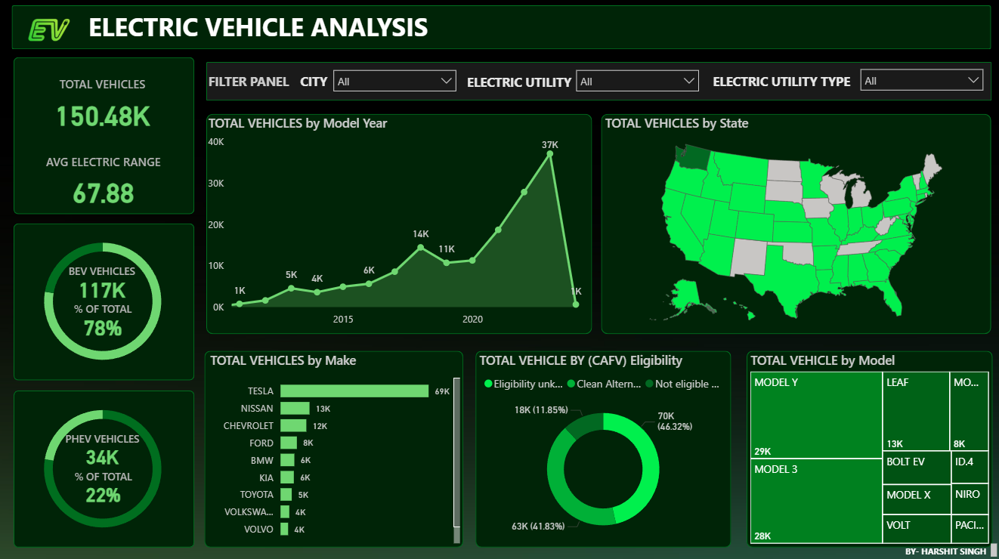

# Electric Vehicle Analysis Dashboard (Power BI)

## Project Overview

This project presents an interactive **Electric Vehicle (EV) Analysis Dashboard** built using **Power BI**. The dashboard provides insights into EV adoption trends, manufacturer performance, vehicle model distribution, and regional EV growth.

The objective of this project is to analyze the electric vehicle market and identify patterns in EV adoption across different states, manufacturers, and vehicle models.

---

## Tools & Technologies

* Power BI
* Power Query
* DAX
* Data Visualization
* Data Cleaning

---

## Dataset

Electric Vehicle Population Dataset

The dataset includes information such as:

* Vehicle Make
* Vehicle Model
* Model Year
* Electric Range
* State
* Electric Utility
* CAFV Eligibility

---

## Key KPIs

* Total Electric Vehicles Registered
* Average Electric Range
* Battery Electric Vehicles (BEV)
* Plug-in Hybrid Electric Vehicles (PHEV)

---

## Dashboard Features

* Year-wise EV adoption trend
* State-wise EV distribution
* Manufacturer-wise vehicle count
* CAFV eligibility analysis
* Vehicle model distribution
* Interactive filters for city, electric utility, and utility type

---

## Key Insights

* EV adoption has increased significantly after 2018.
* Tesla dominates the EV market among manufacturers.
* Battery Electric Vehicles (BEVs) represent the majority of EV registrations.
* Model Y and Model 3 are among the most popular EV models.
* Certain states show higher EV adoption compared to others.

---

## Visualizations Used

* KPI Cards
* Line Chart (EV growth by model year)
* Map Visualization (EV distribution by state)
* Bar Chart (vehicles by manufacturer)
* Donut Chart (CAFV eligibility distribution)
* Treemap (vehicle models distribution)

---

## Project Files

* Power BI Dashboard (.pbix)
* Dataset CSV file
* Dashboard Screenshot
* README Documentation

---

## Dashboard Preview

## Dashboard Preview

---

## Author

Harshit Singh
